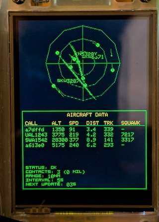

# Retro ADS-B Radar for ESP32 (CYD Display)

This project implements a basic ADS-B radar display on an ESP32 using a CYD (Cheap Yellow Display) ILI9341 display.  

It fetches aircraft data from a local dump1090 instance (or similar) and visualizes them on the radar screen.  This is adapted from the Raspberry Pi project [nicespoon/retro-adsb-radar](https://github.com/nicespoon/retro-adsb-radar) and optimized for MicroPython on the ESP32 with the CYD libraries.

- 

## Features

*   **ADS-B Decoding Visualization:**  Displays aircraft positions, altitude, speed, track, and callsign.
*   **Radar Scope Display:** Presents aircraft as pips on a radar-style screen with range rings and crosshairs.
*   **Aircraft Table:** Provides a tabular listing of nearby aircraft with key information.
*   **Military Aircraft Identification:** Optionally highlights military aircraft in red.
*   **Configurable Parameters:** Adjustable range, display colors, and other settings.
*   **MicroPython Compatibility:** Specifically designed for MicroPython on ESP32 with the CYD library.

## Hardware Requirements

*   ESP32 Development Board
*   CYD ILI9341 Display Module (2.4" or similar)
*   WiFi Connectivity (for fetching data)

## Software Requirements

*   MicroPython Firmware for ESP32
*   [jtobinart/MicroPython\_CYD\_ESP32-2432S028R](https://github.com/jtobinart/MicroPython_CYD_ESP32-2432S028R) CYD Libraries (install on the ESP32)
*   `requests` library
*   `xglcd_font` library

## Installation

1.  **Flash MicroPython:**  Install the latest MicroPython firmware on your ESP32.
2.  **Install CYD Libraries:** Follow the instructions in the [jtobinart/MicroPython\_CYD\_ESP32-2432S028R](https://github.com/jtobinart/MicroPython_CYD_ESP32-2432S028R) repository to install the necessary CYD libraries on your ESP32.
3.  **Install Dependencies:** Connect your ESP32 to your computer and use `mip install requests xglcd_font`.
4.  **Copy Files:** Copy all the Python files (`boot.py`, `main.py`, `cfg.py`, `datatable.py`, `aircraft.py`, `radar.py`, `radarscope.py`, `utils.py`, `fetch.py`) to the root directory of your ESP32.
5.  **Configure WiFi:**  Create a `secrets.py` file (see `secrets.py.example` for the structure) and enter your WiFi SSID and password.  **Do not commit `secrets.py` to version control!**

## Configuration

The `cfg.py` file contains configurable parameters:

*   `DUMP1090_URL`:  The URL of your dump1090 (or similar) server.  Defaults to `http://localhost:8080/aircraft.json`.
*   `LAT`, `LON`: Your latitude and longitude (used for distance calculations).
*   `RADIUS_NM`: The radar display range in nautical miles.
*   `TRAIL_MIN_LENGTH`, `TRAIL_MAX_LENGTH`, `TRAIL_MAX_SPEED`: Parameters controlling the aircraft track trail.
*   `BLINK_MILITARY`:  Enable or disable blinking for military aircraft.
*   `FETCH_INTERVAL`: The interval (in seconds) between data fetches.
*   `MAX_TABLE_ROWS`: The maximum number of rows to display in the aircraft table.
*   `MIL_PREFIX_LIST`: List of hex prefixes to identify military aircraft.
*   Color constants to customize the display.

## About ADSB JSON
- See [docs/ADSB](docs/ADSB.md)

## Code Overview

*   **`boot.py`:** Initializes the ESP32, turns off the RGB LED, and adds the `/libraries` directory to the Python path.
*   **`main.py`:**  Initializes the WiFi connection and starts the `radar.py` script.
*   **`cfg.py`:** Defines configuration parameters (latitude, longitude, display range, etc.).
*   **`datatable.py`:**  Implements the aircraft data table display.
*   **`aircraft.py`:** Defines the `Aircraft` class and includes a test function.
*   **`radar.py`:** Contains the main radar logic, including data fetching, display drawing, and update loops.
*   **`radarscope.py`:**  Provides the radar scope display functions (drawing rings, aircraft, etc.).
*   **`utils.py`:** Utility functions for calculating distance and bearing.
*   **`fetch.py`:** Handles fetching JSON data.

## License

This project is licensed under the MIT License - see the [LICENSE](LICENSE) file for details.
